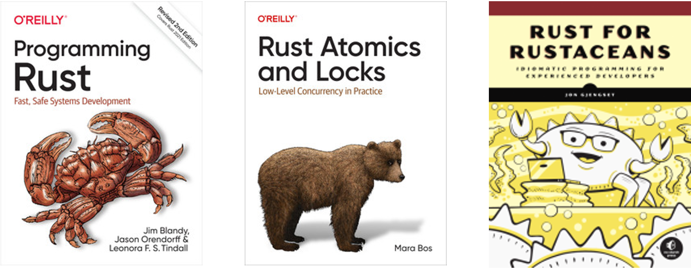
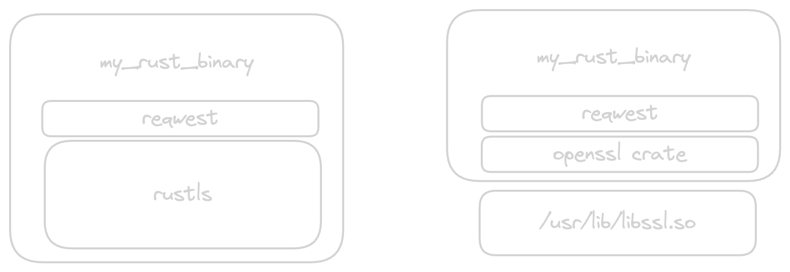
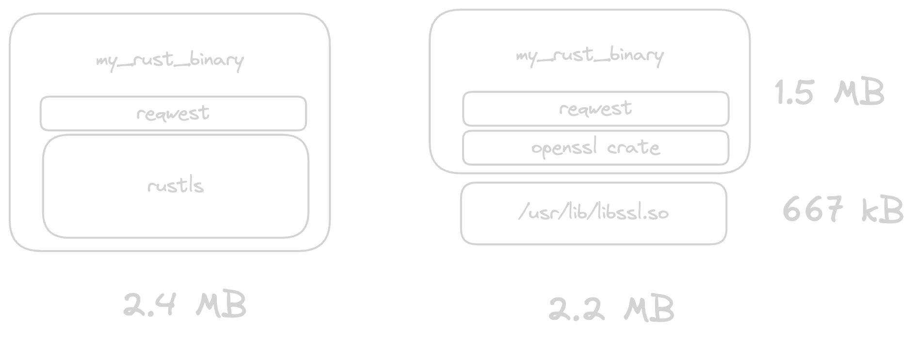

<!-- .slide: data-background-color="#012D25" style="height: 100%;" -->


<div style="height: 100%; display: flex; flex-direction: column; justify-content: space-between; margin-left: 10px; margin-right: 10px;">
<div style="display: flex; justify-content: start;">
    
</div>

<div>
<h3><code>unwrap()</code>-ing Rust on embedded Linux</h1>
<h4>Thomas Sarlandie</h3>
</div>

<div style="display: flex;  align-items: baseline; gap:20px;">
    
    <small>#EmbeddedOSSummit</small>
    <small>@sarfata</small>
</div>

</div>

---

<!-- .slide: data-auto-animate -->

```rust [1-3| 4-6]
//! memfaultd
//! A Linux agent to capture system metrics, report crashes and
//! install updates over the air..

fn main() {
    try_adopt_rust().unwrap();
}
```
<!-- .element: data-id="1" -->

--

<!-- .slide: data-auto-animate -->

```rust [5-42]
fn main() {
    try_adopt_rust().unwrap();
}

fn try_adopt_rust() ->
        Result<(), Box<dyn std::error::Error>> {
    // Can we compile Rust for all supported platforms?
    get_toolchain_and_compiler()?;

    // How long to learn Rust? What do we not know?
    write_code()?;

    // How big will it be? How fast will it run?
    optimize()?;
}
```
<!-- .element: data-id="1" -->

---

<!-- .slide: data-background-color="#fff" -->

<div style="display: flex; margin: 20px;">
<div style="display: flex; flex-shrink:2; flex-direction:column;margin-right: 50px;">


</div>

<pre style="align-self: center;"><code data-line-numbers="1-5|6-12|14-20">> rustup show

Your host: Thomas Sarlandie - @sarfata
Job title: Field CTO @Memfault

experience
----------

linux-appliances
dev-evangelism
sw-eng-management
Pebble - Fitbit

active job
----------

help embedded companies ship better firmware
</code>
</pre>
</div>

---

<!-- .slide: data-background-color="#012D25" -->

# `get_tools()`

---

# Will it run?

--

Will Rust run on all the platforms I need to support?

``` [1-2|4-5]
$ rustc --print target-list |wc -l
237

$ rustc --print target-list |grep -i linux |wc -l
75
```
<!-- .element class="fragment" -->

✅ <!-- .element: class="fragment" -->

--

<!-- .slide: data-auto-animate -->

How do I cross-compile Rust code for my target?

```
$ cargo build --target=armv7-unknown-linux-gnueabihf
// 😕 Requires C cross-compilation environment
// 🚨 Difficult build environment to reproduce ...
```
🐳 <!-- .element: class="fragment" -->

--

<!-- .slide: data-auto-animate -->

How do I cross-compile Rust code for my target?

```
$ cross build --target armv7-unknown-linux-gnueabihf
// Docker based
// Supports custom build environments with dynamic libraries
```

✅ <!-- .element: class="fragment" -->

---

<!-- .slide: data-background-color="#ddd" -->

<div style="display: flex; align-items: center; gap: 30px; justify-content: center;">🦀 <span>+</span> 

--

<!-- .slide: style="position: relative;" -->

- meta-rust
  - Started by Cody Shafer in 2014
  - Merged by Randy MacLeod in Yocto 3.4 Honister
  - Provides a `cargo` class to build rust crates
  - Builds the rust compiler from source
  - Requires explicit dependency list (via `cargo-bitbake`)
  - `meta-rust/meta-rust` remains available for a more recent version

| Yocto      | Rust   |
| ---------- | ------ |
| Honister   | 1.54   |
| Kirkstone  | 1.59   |
| Langdale   | 1.63   |
| Mickledore | 1.68.2 |
| Scarthgap  | 1.75   |
<!-- .element: style="position: absolute; font-size: 0.4em; right: 100px; width: 20%; right: 10px; top: 0px; background-color: #333; border-radius: 5px; box-shadow: 5px 5px 3px #000;" -->

--

- meta-rust-bin
  - A project of the rust-embedded working group
  - Uses pre-compiled binaries for `rustc`, `cargo`, and `libstd-rs`
  - Compatible with all versions of Yocto since `dunfell`
  - Uses a different class name (`cargo_bin`) and can be used in parallel to `meta-rust`

--

| meta-rust                      | meta-rust-bin                      |
| ------------------------------ | ---------------------------------- |
| Yocto Official                 | Rust WG Official                   |
| Builds from source (Slower)    | Uses pre-compiled binaries         |
| Requires explicit dependencies | Automatically fetches dependencies |
| Locked version of Rust         | Latest version of Rust             |
<!-- .element: style="margin: 80px;" -->


Rust on Yocto? ✅ <!-- .element: class="fragment" -->

<p style="font-size: 0.5em; text-align: center; color:#ddd;">Shameless plug: <a href="https://interrupt.memfault.com/blog/rust-in-yocto">interrupt.memfault.com/blog/rust-in-yocto</a></p>

---

<!-- .slide: data-background-color="#012D25" -->

# `write_code()`

---


## Adoption Strategy

rusting the C code - one file at a time <!-- .element: class="fragment" -->

--

`mylib.c`
```c
extern "C" void do_something();

void main_loop() {
    while (1) {
        do_something();
    }
}
```

`main.rs` <!-- .element class="fragment" data-fragment-index="1"-->
```rust
extern "C" fn main_loop();

fn main() {
    main_loop();
}

extern "C" fn do_something() {
    // Do something
}
```
<!-- .element class="fragment" data-fragment-index="1"-->

--

`build.rs`
```rust
// Example custom build script.
fn main() {
  // Tell Cargo that if the given file changes, to rerun this build script.
  println!("cargo::rerun-if-changed=src/hello.c");
  // Use the `cc` crate to build a C file and statically link it.
  cc::Build::new()
    .file("src/hello.c")
    .compile("hello");
}


```

<span>For more complicated libraries – see the `cmake` crate.</span> <!-- .element: class="fragment" -->

---

<!-- .slide: data-auto-animate -->
# Learning Some Rust <!-- data-id="title" -->

--

<!-- .slide: data-auto-animate -->
### Learning Some Rust<!-- data-id="title" -->

 <!-- .element: style="width: 90%;" -->

--

<!-- .slide: data-auto-animate -->
### Learning Some Rust<!-- data-id="title" -->

<!-- .element: style="width: 50%;" -->

- [The Rust Programming Language book](https://doc.rust-lang.org/book/)
- [doc.rust-lang.org/std](https://doc.rust-lang.org/std) => `Vec`, `String`, `PathBuf`, `Option`, `Result`, etc.
- [Advent Of Code](https://adventofcode.com/), YouTube
- Get Help - 🙏 [James Munns](https://jamesmunns.com)

---

# 📚 Lessons learnt ...

---

<!-- .slide: data-background-color="pink" -->

# ❤️‍🩹 the Borrow Checker

--
``` [1-12|13-16|19-30]
error[E0382]: borrow of moved value: `paths`
   --> src/main.rs:8:34
    |
4   |     let paths: Vec<PathBuf> = vec![];
    |         ----- move occurs because `paths` has type `Vec<PathBuf>`,
                    which does not implement the `Copy` trait
5   |
6   |     paths.into_iter().map(|p| File::create(p));
    |           ----------- `paths` moved due to this method call
7   |
8   |     println!("Created {} files", paths.len());
    |                                  ^^^^^^^^^^^ value borrowed here after move
    |
note: `into_iter` takes ownership of the receiver `self`, which moves `paths`
   --> /.../src/rust/library/core/src/iter/traits/collect.rs:271:18
    |
271 |     fn into_iter(self) -> Self::IntoIter;
    |                  ^^^^
help: you can `clone` the value and consume it, but this might not be your
desired behavior
    |
6   |     paths.clone().into_iter().map(|p| File::create(p));
    |           ++++++++
```
<!-- .element: style="font-size:0.5em; width: 98%; margin: 0;" -->

Take your time - Read the error message <!-- .element: class="fragment" -->

--

_beginner_ Rust

```rust
/// Memfault Network client
pub struct Client<'a> {
    client: blocking::Client,
    config: &'a MemfaultdConfig,
    device_info: &'a DeviceInfo,
}

impl<'a> Client<'a> {
    pub fn new(config: &'a MemfaultdConfig,
               device_info: &'a DeviceInfo)
            -> Result<Self> {
        // ...
    }
}
```
<!-- .element: data-id="1" -->

<p>🤓 Look Ma! I can use lifetimes!<br/>No un-necessary copies!</p> <!-- .element: class="fragment" -->

--
<!-- .slide: data-auto-animate -->

**pro** Rust

```rust
/// Memfault Network client
pub struct NetworkClientImpl {
    client: blocking::Client,
    config: NetworkConfig,
}


impl NetworkClientImpl {
    pub fn new(config: NetworkConfig) -> Result<Self> {
        // ...
    }
}
```
<!-- .element: data-id="1" -->

<p>👩‍🏫 Avoid early optimization - Value simplicity</p> <!-- .element: class="fragment" -->


--

<!-- .slide: data-background-color="red" -->

# 💣

--

Rust will protect you from **unexpected behavior**
<small>(as long as you stay away from `unsafe()`).</small><!-- .element class="fragment" -->

--

But your program can still crash ...

```rust
    serde_json::from_str::<Value>("{ key: 42 }").unwrap();
```
<!-- .element: style="font-size: 0.4em" -->

```shell
$ cargo run
thread 'main' panicked at 'called `Result::unwrap()` on an `Err` value:
    Error("key must be a string", line: 1, column: 3)'
```
<!-- .element: class="fragment" style="font-size: 0.4em" -->

```rust
    let v = vec![0];
    v[42]
```
<!-- .element: class="fragment" style="font-size: 0.4em; margin-top: 60px;" -->
```shell
$ cargo run
thread 'main' panicked at 'index out of bounds:
    the len is 1 but the index is 42'
```
<!-- .element: class="fragment" style="font-size: 0.4em" -->

--

- Treat `unwrap()`, `expect()`, etc as you would asserts in C.
- Understand what happens when a _Thread_ panics.
- Have a strategy for dealing with crashed threads.

---

<!-- .slide: data-auto-animate-->

# ‍🤹Concurrency

--

<!-- .slide: data-auto-animate-->

- Embrace Memory Safe concurrency!

--

<!-- .slide: data-auto-animate-->

- Choose one paradigm and stick to it
  - Shared memory with `Arc<Mutex<T>>`
  - Worker pool: Many threads working on one list of tasks
  - Actors: Independent threads communicating via messages

--

<!-- .slide: data-auto-animate-->

- The borrow checker does not protect you from deadlocks


---

<!-- .slide: data-background-color="#012D25" -->

# `optimize()`

--


```shell
$ cargo init
$ cat src/main.rs
fn main() {
    println!("Hello, world!");
}
$ cargo build --release
$ du -sh target/release/helloworld
4.4M    target/release/helloworld
```

# 🤬  <!-- .element: class="fragment" -->
don't panic!  <!-- .element: class="fragment" -->

--

```shell
$ cat > Cargo.toml <<EOF
[profile.release]
# Strip your binaries of debug information
strip = true

# Optimize for size
opt-level = "z"

# Remove the default panic handler
panic = "abort"
EOF

$ du -sh target/release/helloworld
372k    target/release/helloworld
```

😅 <!-- .element: class="fragment" -->

🤨 <!-- .element: class="fragment" -->

--

```shell
$ cargo install cargo-bloat
$ cargo bloat --release --crates
    Finished release [optimized] target(s) in 0.00s
    Analyzing target/release/helloworld

File  .text     Size Crate
5.8%  98.1% 258.7KiB std
0.0%   0.0%      83B [Unknown]
0.0%   0.0%      56B helloworld
5.9% 100.0% 263.6KiB .text section size, the file size is 4.4MiB
```

--

Get rid of `std`

```rust [1-10|12-20]
#![no_std]
#![no_main]

use libc_print::libc_println;

#[no_mangle]
pub extern "C" fn main() -> isize {
    libc_println!("Hello World");
    0
}

#[cfg(not(test))]
use core::panic::PanicInfo;

#[cfg(not(test))]
#[panic_handler]
fn panic(_panic: &PanicInfo<'_>) -> ! {
    loop {}
}
```

--

```shell
$ cargo bloat --release --crates
   Compiling helloworld v0.1.0 (/home/thomas/embdlinux/helloworld)
    Finished release [optimized] target(s) in 0.24s
    Analyzing target/release/helloworld

File  .text   Size Crate
0.1%  65.6%   836B std
0.0%  10.0%   128B [Unknown]
0.0%   7.8%   100B libc_print
0.2% 100.0% 1.2KiB .text section size, the file size is 813.5KiB

$ strip target/release/helloworld
    && du -sh target/release/helloworld
16K     target/release/helloworld

$ objdump -h -j .text  target/release/helloworld
target/release/helloworld:     file format elf64-x86-64

Sections:
Idx Name          Size      VMA               LMA               File off  Algn
 13 .text         000004fb  0000000000001040  0000000000001040  00001040  2**4
                  CONTENTS, ALLOC, LOAD, READONLY, CODE
```
<!-- .element: style="font-size: 0.3em;" -->

1275 bytes of code<br/><small>(`0x4fb`)</small>

--

The same program in C

```c
$ cat > main.c
#include <stdio.h>

int main() { printf("Hello World\n"); }

$ gcc -o main -Os main.c
$ strip main

$ ls -al main target/release/helloworld
-rwxrwxr-x 1 thomas thomas 14472 Mar 26 23:29 main
-rwxrwxr-x 2 thomas thomas 14400 Mar 26 23:18 target/release/helloworld
```

🍾 Rust binary is smaller than C!!!

--

<!-- .slide: data-animate-auto -->

# 🗜️ Take aways

- Rust’s `std` is about 260 kB
- It’s statically linked in each rust binary

--
<!-- .slide: data-animate-auto -->

- You can …
  - Do without `std`
  - Keep chiseling
    - Compile `std` from source – Enables better dead-code removal and optimizing for size
    - 🙏 [johnthagen/min-sized-rust](https://github.com/johnthagen/min-sized-rust)
  - Embrace `std`
    - Use a busybox approach to avoid multiplying copies of Rust's `std` on disk


---

<!-- .slide: data-background-color="#012D25" -->

# `optimize() // more`

--

### Adding libraries to your project...




--

```rust
// main.rs
fn main() {
    let body = reqwest::blocking::get("https://www.rust-lang.org")
        .unwrap()
        .text()
        .unwrap();

    println!("body = {body:?}");
}
```

```toml
[features]
rust-tls = ["reqwest/rustls-tls"]
openssl-tls = ["reqwest/native-tls"]
```

```shell
$ cargo build --release --features=rust-tls
$ cargo build --release --features=openssl-tls
```

--



---
<!-- .slide data-auto-animate -->
<!-- .slide: data-background-color="#012D25" -->

# 🎂 18 months in

--

<!-- .slide: data-background-color="#ddd" -->

<!-- .slide data-auto-animate -->

We love 🦀

Our code reviews are so much more interesting

You will never read&write C code the same way


--

<!-- .slide: data-background-color="#012D25" style="height: 100%;" -->


<div style="display: flex; flex-direction: column; justify-content: center; align-items: center; height: 100%;">

</div>
